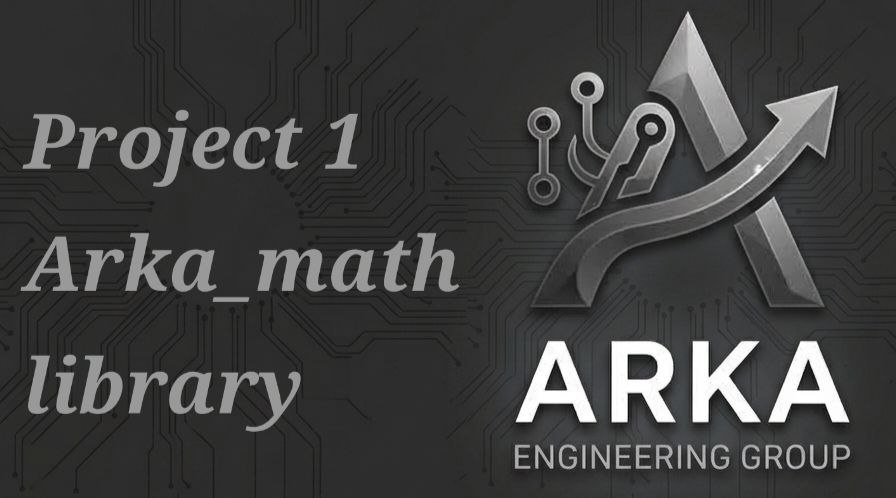

# 🧮 کتابخانه ریاضی Arka_math

این پروژه یک کتابخانه جامع ریاضی در پایتون است که با رویکرد **تابع‌نویسی (Functional Programming)** توسعه داده می‌شود. وظایف توسعه این پروژه در ۵ گروه تخصصی ۴ نفره تقسیم‌بندی شده است تا تمامی ماژول‌های محاسباتی به صورت مستقل پیاده‌سازی و در نهایت یکپارچه شوند.

---

## 📐 گروه اول: مثلثات (Trigonometry)
> **تمرکز این گروه:** محاسبه مقادیر مثلثاتی با استفاده از تقریب‌های عددی و سری‌ها (بدون استفاده از کتابخانه `math` پایتون).

* **👤 عضو ۱ (توابع پایه و تبدیل واحد):**
  * نوشتن توابع تبدیل زاویه (`degree_to_radian` و `radian_to_degree`).
  * پیاده‌سازی توابع اصلی `sin(x)` و `cos(x)` با استفاده از بسط تیلور (دریافت تعداد جملات سری تیلور به عنوان آرگومان اختیاری برای تنظیم دقت تقریب).
* **👤 عضو ۲ (توابع ثانویه و مدیریت استثناها):**
  * پیاده‌سازی توابع `tan(x)`، `cot(x)` `sec(x)` و `csc(x)` با استفاده از خروجی‌های توابع عضو اول.
  * مدیریت خطای مجانب‌ها (مانند هندل کردن خطای تقسیم بر صفر در تانژانت زاویه ۹۰ درجه).
* **👤 عضو ۳ (توابع معکوس مثلثاتی):**
  * پیاده‌سازی توابع  `arcsin(x)` `arccos(x)` و `arctan(x)`.
  * استفاده از بسط مک‌لورن مخصوص توابع معکوس و تعریف دقیق دامنه ورودی (بین $1-$ تا $1$ برای سینوس و کسینوس معکوس).
* **👤 عضو ۴ (توابع هیپربولیک/هذلولوی):**
  * نوشتن تابع پایه برای محاسبه $e^x$ (تابع نمایی با سری تیلور).
  * پیاده‌سازی توابع کاربردی در مهندسی شامل `sinh(x)`، `cosh(x)` و `tanh(x)` با استفاده از فرمول‌های نمایی.

---

## 🧮 گروه دوم: ماتریس‌ها (Matrices)
> **تمرکز این گروه:** کار با ماتریس‌ها به عنوان لیست‌های تودرتو (List of Lists) و انجام عملیات جبر خطی.

* **👤 عضو ۱ (ساختار و اعتبارسنجی):**
  * بررسی اعتبار ماتریس (مساوی بودن طول همه سطرها).
  * استخراج ابعاد ماتریس (تعداد سطر و ستون).
  * توسعه تابعی برای چاپ قالب‌بندی‌شده و زیبای ماتریس در کنسول جهت دیباگ کردن کدها توسط سایر اعضا.
* **👤 عضو ۲ (عملیات پایه):**
  * پیاده‌سازی توابع جمع، تفریق و ضرب یک عدد اسکالر در ماتریس.
  * بررسی شروط پایه‌ای (مانند برابری ابعاد) قبل از انجام هرگونه عملیات.
* **👤 عضو ۳ (ضرب و ترانهاده):**
  * پیاده‌سازی الگوریتم ضرب ماتریسی (سطر در ستون) همراه با شرط برابری ستون‌های ماتریس اول و سطرهای ماتریس دوم.
  * نوشتن تابع ترانهاده (Transpose) برای جابه‌جایی درایه‌های $a_{ij}$ با $a_{ji}$.
* **👤 عضو ۴ (دترمینان و الگوریتم‌های بازگشتی):**
  * پیاده‌سازی تابع بازگشتی (Recursive) برای محاسبه دترمینان ماتریس‌های $N \times N$.
  * نوشتن توابع کمکی برای یافتن کهاد (Minor) ماتریس.

---

## 🔍 گروه سوم: حل معادلات (Equation Solving)
> **تمرکز این گروه:** یافتن ریشه‌های معادلات و بازگرداندن خروجی‌ها به شکل تاپل (Tuple) یا لیست.

* **👤 عضو ۱ (معادلات پایه و تحلیلی):**
  * پیاده‌سازی توابع حل دقیق معادلات درجه اول و درجه دوم.
  * مدیریت اعدادی با ریشه‌های منفی و تولید خروجی از نوع اعداد مختلط (`complex`) در پایتون.
* **👤 عضو ۲ (حل عددی روش نیوتن-رافسون):**
  * پیاده‌سازی الگوریتم نیوتن-رافسون برای یافتن ریشه معادلات دلخواه.
  * دریافت سه آرگومان ورودی: تابع ریاضی، تابع مشتق آن (مستخرج از ماژول گروه ۴) و نقطه حدس اولیه.
* **👤 عضو ۳ (حل عددی روش Bisection):**
  * پیاده‌سازی الگوریتم نصف کردن (تنصیف).
  * دریافت بازه $[a, b]$، بررسی شرط تغییر علامت و کوچک کردن بازه تا رسیدن به دقت مطلوب (تلورانس خطا).
* **👤 عضو ۴ (حل دستگاه معادلات خطی):**
  * پیاده‌سازی روش کرامر (Cramer's Rule) برای حل دستگاه معادلات.
  * دریافت دستگاه به شکل دو ماتریس ضرایب و مقادیر، و فراخوانی تابع دترمینان (از ماژول گروه ۲) برای محاسبه ریشه‌ها.

---

## 📉 گروه چهارم: مشتق (Derivative)
> **تمرکز این گروه:** انجام محاسبات عددی با گام‌های بسیار کوچک (مانند $h = 10^{-5}$) برای تحلیل تغییرات توابع.

* **👤 عضو ۱ (مشتق‌گیری مرتبه اول):**
  * محاسبه مشتق با تقریب‌های «تفاضل پیش‌رو»، «تفاضل پس‌رو» و «تفاضل مرکزی».
  * محاسبه و بازگرداندن شیب خط مماس در یک نقطه مشخص $x$.
* **👤 عضو ۲ (مشتقات مراتب بالاتر):**
  * پیاده‌سازی تابعی برای محاسبه مشتق مرتبه دوم و سوم با تعمیم فرمول‌های تفاضلی جهت تحلیل تقعر نمودارها.
* **👤 عضو ۳ (مشتقات جزئی و گرادیان):**
  * دریافت یک تابع چندمتغیره به همراه برداری از نقاط.
  * محاسبه مشتق جزئی (Partial Derivative) نسبت به یک متغیر خاص (با ثابت نگه داشتن سایر متغیرها).
* **👤 عضو ۴ (کاربرد مشتق):**
  * یافتن نقاط اکسترمم نسبی (ماکزیمم و مینیمم لوکال) در یک بازه مشخص با دریافت یک رابطه ریاضی.
  * تولید و چاپ معادله خط مماس بر نمودار به صورت یک رشته متنی (String).

---

## 📈 گروه پنجم: انتگرال (Integral)
> **تمرکز این گروه:** محاسبه مساحت زیر نمودار در بازه مشخص $[a, b]$ بر اساس تعداد گام‌های تقسیم‌بندی ($n$).

* **👤 عضو ۱ (مجموع ریمان):**
  * پیاده‌سازی الگوریتم‌های پایه مستطیلی چپ، راست و نقطه میانی جهت ایجاد درک پایه‌ای از انتگرال‌گیری عددی.
* **👤 عضو ۲ (روش ذوزنقه‌ای):**
  * پیاده‌سازی انتگرال‌گیری با تقریب ذوزنقه‌ای برای دستیابی به دقت محاسباتی بالاتر نسبت به روش مستطیلی.
* **👤 عضو ۳ (روش سیمپسون):**
  * پیاده‌سازی قانون سیمپسون با استفاده از برازش سهمی‌ها روی نقاط، برای رسیدن به بالاترین دقت در میان روش‌های کلاسیک.
* **👤 عضو ۴ (انتگرال دوگانه):**
  * پیاده‌سازی تابع محاسبه انتگرال روی فضاهای دو بعدی.
  * دریافت رابطه دو متغیره $f(x,y)$ و دو بازه مجزا (برای $x$ و $y$) و محاسبه حجم زیر رویه با استفاده از حلقه‌های تودرتو.